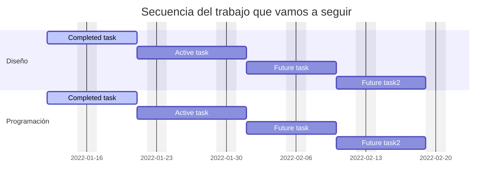

---
# try also 'default' to start simple
theme: seriph
# random image from a curated Unsplash collection by Anthony
# like them? see https://unsplash.com/collections/94734566/slidev
background: https://source.unsplash.com/collection/94734566/1920x1080
# apply any windi css classes to the current slide
class: 'text-center'
# https://sli.dev/custom/highlighters.html
highlighter: shiki
# show line numbers in code blocks
lineNumbers: true
# some information about the slides, markdown enabled
info: |
  ## Slidev Starter Template
  Presentation slides for developers.

  Learn more at [Sli.dev](https://sli.dev)
# persist drawings in exports and build
drawings:
  persist: false
---

# Desarrollo web

Diseño y desarrollo de aplicaciones web

<!--
The last comment block of each slide will be treated as slide notes. It will be visible and editable in Presenter Mode along with the slide. [Read more in the docs](https://sli.dev/guide/syntax.html#notes)
-->

---

layout: center
class: text-center

---

# ¿Qué esperamos?

Crearemos! un producto que responda a una necesidad.

---

# Fases del trabajo

Las fases serán las siguientes



---

## layout: section

# Diseño web

Damos estilo a nuestra web

---

layout: iframe-right
url: https://app.brandmark.io/v3/

---

# Elegimos el branding

Importante tomar algunas decisiones y ser coherentes.

- Diseño unificado
- Colores simples
- Logotipo y fuente
- Paleta de colores

[Ejemplo de arte final](https://app.brandmark.io/v3/#logo_data=%7B%22id%22%3A%22logo-4e09912b-a848-4d26-9b7d-01fe6669ad28%22%2C%22layout%22%3A2%2C%22title%22%3A%22Ai!%20Que%20Arte%22%2C%22titleFamily%22%3A%22Special%20Elite%22%2C%22titleVariant%22%3A%22regular%22%2C%22titleColor%22%3A%5B%7B%22hex%22%3A%22%23313026%22%7D%5D%2C%22titleScale%22%3A0.83%2C%22titleLetterSpace%22%3A0%2C%22titleLineSpace%22%3A1.1%2C%22titleBoldness%22%3A0%2C%22titleX%22%3A0%2C%22titleY%22%3A0%2C%22titleAlign%22%3A%22center%22%2C%22slogan%22%3A%22Arte%20digital%20con%20inteligencia%20artificial%22%2C%22sloganFamily%22%3A%22Fira%20Sans%20Condensed%22%2C%22sloganVariant%22%3A%22400%22%2C%22sloganColor%22%3A%5B%7B%22hex%22%3A%22%23dd5a40%22%7D%5D%2C%22sloganScale%22%3A0.75%2C%22sloganLetterSpace%22%3A0%2C%22sloganLineSpace%22%3A1.1%2C%22sloganBoldness%22%3A0%2C%22sloganAlign%22%3A%22center%22%2C%22sloganX%22%3A0%2C%22sloganY%22%3A0%2C%22icon%22%3A%7B%22type%22%3A%22noun%22%2C%22id%22%3A88882%2C%22preview%22%3A%22https%3A%2F%2Fapp.brandmark.io%2Fnounpreview%2F88882.png%22%7D%2C%22showIcon%22%3Atrue%2C%22iconScale%22%3A1%2C%22iconColor%22%3A%5B%7B%22hex%22%3A%22%23dd5a40%22%7D%5D%2C%22iconContainer%22%3Anull%2C%22showIconContainer%22%3Afalse%2C%22iconContainerScale%22%3A1%2C%22iconContainerColor%22%3A%5B%7B%22hex%22%3A%22%23e8baaa%22%7D%5D%2C%22iconSpace%22%3A1%2C%22iconX%22%3A0%2C%22iconY%22%3A0%2C%22nthChar%22%3A0%2C%22container%22%3Anull%2C%22showContainer%22%3Afalse%2C%22containerScale%22%3A1%2C%22containerColor%22%3A%5B%7B%22hex%22%3A%22%23e8baaa%22%7D%5D%2C%22containerX%22%3A0%2C%22containerY%22%3A0%2C%22backgroundColor%22%3A%5B%7B%22hex%22%3A%22%23eeeadf%22%7D%5D%2C%22palette%22%3A%5B%22%23eeeadf%22%2C%22%23313026%22%2C%22%236a3e2e%22%2C%22%23a34c37%22%2C%22%23dd5a40%22%5D%2C%22keywords%22%3A%5B%22robot%22%2C%22ai%22%2C%22art%22%5D%7D)

---

## layout: quote

# Cuida tu diseño

Vigila que tu diseño esté cuidado y sea consistente.

```css {2|3,4|6|a}
.block1 {
  position: absolute;
  width: 163.49px;
  height: 35.74px;

  background: #EEEADF;
}
```

---

layout: iframe-right
url: https://www.figma.com/embed?embed_host=share&url=https%3A%2F%2Fwww.figma.com%2Ffile%2FkMeOzQaej47ohh705Sc2wO%2FAiEjemplo%3Fnode-id%3D0%253A1

---

# Crear la identidad y copiar las imágenes

Llevamos la creación a figma, con ayuda de las herramientas de edición de Brandmark, sacar:

- SVG del logotipo (modo inspección de código y copiar)
- Colores (pasar a cuadros de texto)
- Extraer las fuentes: <small>En el modo edición se puede ver la fuente si se ubica encima. Al ser fuentes de Google WebFonts están disponibles en figma.</small>

<style>
  li {
    line-height: 1.2em;
    margin-bottom: 0.6em;
  }
  small {
    line-height: 0.8em;
  }
</style>

---

layout: center
class: text-center

---

# Mañana más

[Evalua tu trabajo](https://track.tic.escuelaideo.edu.es)
