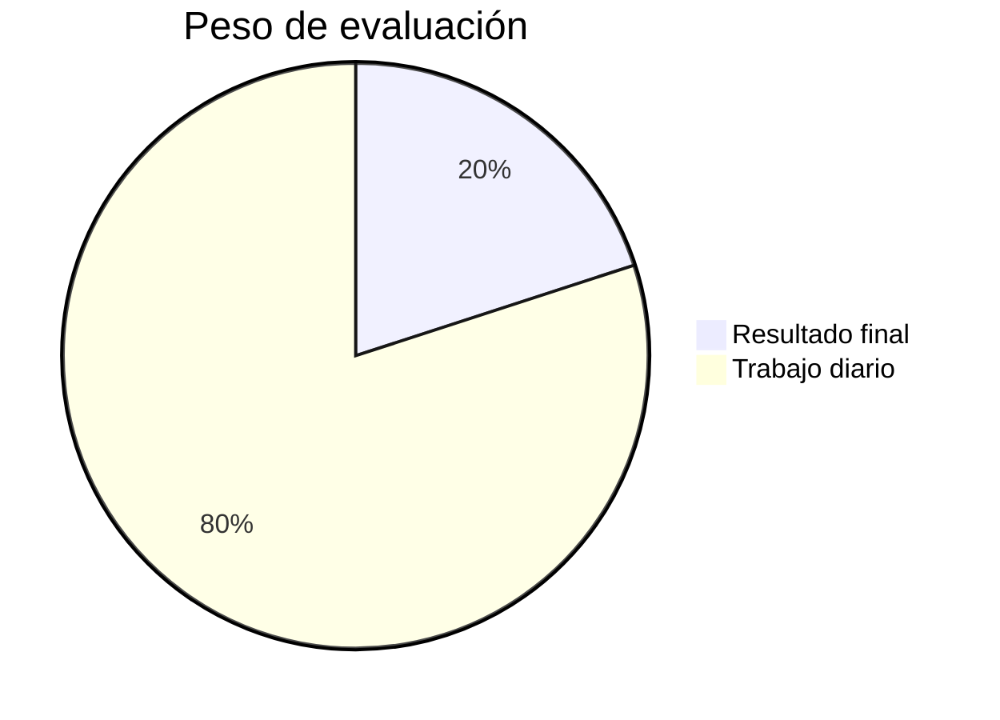
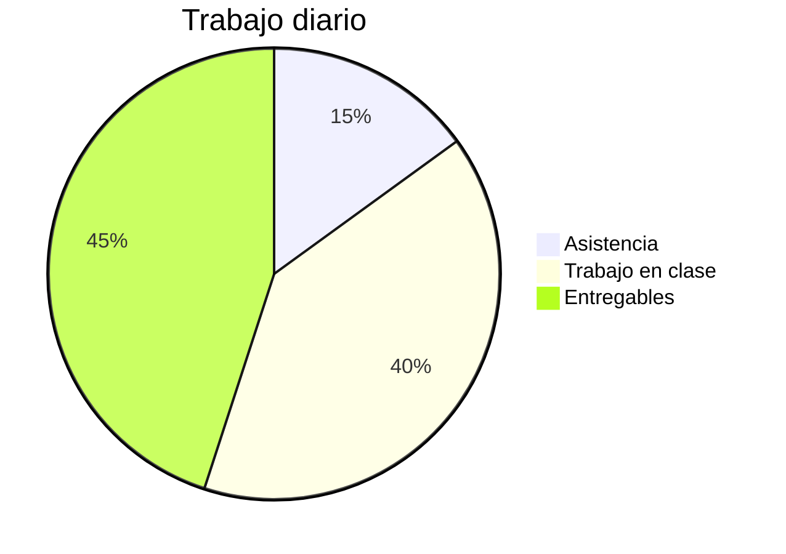
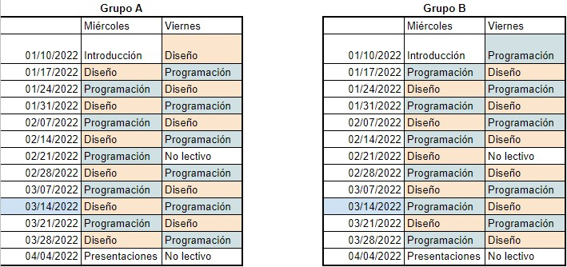

---
# try also 'default' to start simple
theme: seriph
# random image from a curated Unsplash collection by Anthony
# like them? see https://unsplash.com/collections/94734566/slidev
background: https://source.unsplash.com/collection/590961/1920x1080
# apply any windi css classes to the current slide
class: 'text-center'
# https://sli.dev/custom/highlighters.html
highlighter: shiki
# show line numbers in code blocks
lineNumbers: true
# some information about the slides, markdown enabled
info: |
  ## TIC 1
  Escuela IDEO
  
# persist drawings in exports and build
drawings:
  persist: false
---

# Presentación 2º Trimestre
Tecnologías de la Información y Comunicación II

---
layout: center
class: text-center
---

# Objetivo del trimestre

Desarrollar una aplicación web que resuelva una necesidad de la escuela

Desarrollaremos una página web <b>HTML</b> con contenido dinámico gestionado a través de una <b>base de datos</b>.

---
layout: two-cols
---

# Diseño
Diseño del concepto y del estilo visual.

Fases:
- Definición identidad de marca
- Diseño de logotipo
- Elección de paleta de colores y tipografía
- Diseño de estructura de página web
- Definición de cada una de las páginas
- Generación de hoja de estilos en Glitch
- Construcción de base de datos
- Generación de otros elementos visuales

::right::

# Programación
Estructura e integración con la Base de Datos.

Fases:
- Entorno de desarrollo web
- Comprensión de estructura HTML
- Uso de elementos HTML más comunes
- Integración con hojas de estilo
- Uso de framework de generación de páginas por bloques de contenido
- Integración de la base de datos
- Generación de páginas dinámicas
- Publicación de sitio web

---

# Herramientas

- Figma - Diseño visual
- Brandmark - Diseño de marca
- Coolors - Paletas de colores
- Github - Repositorio de código público
- Glitch - Generación de estilo con css
- Airtable - Construcción de bases de datos de modo visual
- CodeSandbox - Entorno de desarrollo online
- Astro - Framework de construcción de web estáticas con bloques
- Vercel - Servicio de publicación de páginas web estáticas

---

# Modo de evaluación

Modificación del proceso de evaluación de este trimestre para dar valor al resultado final del producto.

---

# Modo de evaluación

Recordatorio del trabajo diario.

Uso de Tic Track en ambos bloques.

---

# Requisitos evaluables de las entregas
Los aspectos que se consideran en la evaluación son:

- Ortografía correcta y forma académica
- Responde de forma completa y adecuada a las preguntas que se formulan
- Refleja una integración adecuada del trabajo realizado durante la sesión
- Se entrega en tiempo

---
layout: cover
background: https://source.unsplash.com/collection/181373/1920x1080
---

# Aprendizaje servicio

---

# Ideas de proyectos

- Catálogo de especies vegetales del colegio - Plan verde : Proyectos iniciados con información existente (Ana Mangas y Marta Balbás) - Cuentan con información y es un proyecto que va a continuar y crecer. Acceso con cartelería de QR.
- Investigación histórica del edificio - Patrimonio cultural (Ángeles Garoz) - Cuentan con información y es un proyecto que va a continuar y crecer.
- Especies del huerto (plantación, recolección).
- Catálogo de proyectos (Lara).
- Web de oferta de extraescolares y club deportivo (Pablo Megino).
- Catálogo de obras de arte de bachillerato artístico.
- Inventario de herramientas de tecnología (Juan Gómez).
- ...

---

# Características que debe tener el proyecto 1/2

- Se compondrá de un conjunto de páginas informativas
- Habrá al menos un elemento principal: obras digitales
- Habrá al menos un elemento secundario: colecciones
- El elemento principal tendra:
    - Nombre
    - Imagen
    - Descripción
    - Otras propiedades
    - Se agrupará en un elemento secundario
- El elemento sencundario tendrá:
    - Nombre
    - Descripción

---

# Características que debe tener el proyecto 2/2

- Puede haber otros elementos dinámicos
- La web tendrá al menos 5 páginas diferentes (sin contar dinámicas): principal, acerca de, contacto, listado de obras, detalle de obra...
- Se valorará que el proyecto resuelva una necesidad dentro de la escuela

---

# Modo de trabajo

Para realizar el proyecto trabajaremos de la siguiente manera.

Alternamos el ámbito de trabajo cada dos sesiones: 2 sesiones de programación y 2 de diseño

---

# Organización de equipos

La entrega de cada proyecto es individual.

- Cada persona tendrá su propio proyecto.
- Será posible colaborar y ayudarse.
- Así también estará permitido intercambiar código.
- Cada persona tendrá que ser fiel a su diseño.
- El código de nuestro trabajo será siempre público, en caso de usar algo de otro compañero habrá que dar crédito.

---

# Tarea de hoy

- Pensar y proponer una idea
- La web tendrá al menos 5 páginas diferentes (sin contar dinámicas): principal, acerca de, contacto, listado de obras, detalle de obra...
- Se valorará que el proyecto resuelva una necesidad dentro de la escuela