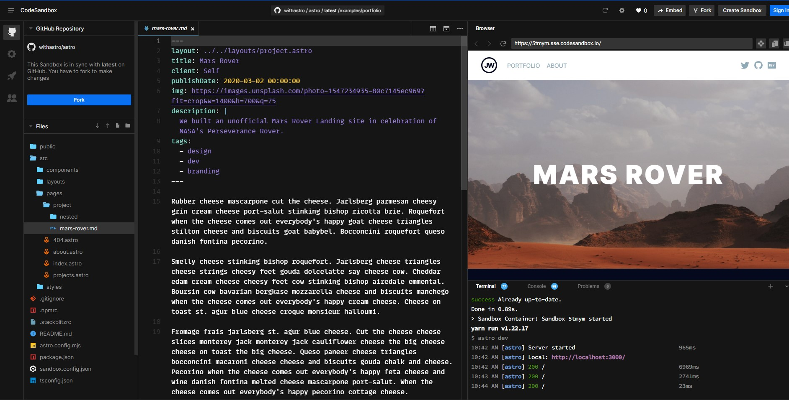
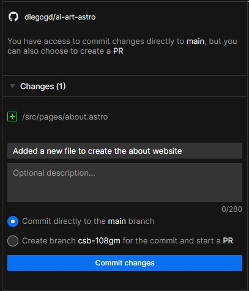

---
# try also 'default' to start simple
theme: seriph
# random image from a curated Unsplash collection by Anthony
# like them? see https://unsplash.com/collections/94734566/slidev
background: https://source.unsplash.com/collection/590961/1920x1080
# apply any windi css classes to the current slide
class: 'text-center'
# https://sli.dev/custom/highlighters.html
highlighter: shiki
# show line numbers in code blocks
lineNumbers: true
# some information about the slides, markdown enabled
info: |
  ## Slidev Starter Template
  Presentation slides for developers.

  Learn more at [Sli.dev](https://sli.dev)
# persist drawings in exports and build
drawings:
  persist: false
---

# Programación

---
layout: image-right
image: https://source.unsplash.com/collection/590961/1080x1080
---

# Entorno de trabajo

Trabajaremos con el entorno CodeSandbox ya que permite trabajar con vscode en web y con Astro.

---

# Astro

Astro es un sistema que nos permite crear páginas estáticas muy complejas de una forma muy sencilla.

---
layout: center
---

# CodeSandbox y Astro

---

# Crear un proyecto de Astro en CodeSandbox

Para comenzar hay que hacer lo siguiente:

- Crear una cuenta en [github](https://www.github.com)
- Acceder al siguiente enlace [Crear proyecto en CodeSandbox](https://astro.new/minimal?on=codesandbox)
- Click on Sign In --> Sign in with Github
- Click on Fork
- En la pestaña de Github <mdi-github/> localizar el botón `Sign In` junto al texto "Enable Commits"
- En el apartado "Export to new Github repository" poner el texto con el nombre de vuestro proyecto. Por ejemplo en el mío es `ai-art-astro`.

A partir de ahora ya tenéis vuestro propio repositorio.

---

# Compartir vuestro proyecto

A partir del trabajo que habéis hecho tendréis una dirección única para trabajar desde vuestro proyecto.

Por ejemplo la mía es [`https://codesandbox.io/s/github/diegogd/ai-art-astro/tree/main/`](https://codesandbox.io/s/github/diegogd/ai-art-astro/tree/main/)

Ese repositorio estará público y accesible para todo el mundo. Mantenedlo así para garantizar el acceso.

<mdi-eye/> No es la página con la que trabajaremos.

---

# Guardar los cambios

En el momento que se crea o edita un archivo nuevo se creará un proyecto de trabajo.

Ese será el proyecto de trabajo. El mío es: [https://codesandbox.io/s/eager-shape-108gm](https://codesandbox.io/s/eager-shape-108gm) **Ese será el enlace que tenéis que compartir conmigo**

Una vez abierto este proyecto ir de nuevo al icono de github <mdi-github/>

Pulsar en `Link Sandbox`, a partir de ese momento ya podremos mandar los cambios a nuestro repositorio. 

---
class: text-center
---

# Commit

<mdi-warning/> Es muy importante que mandemos los cambios al repositorio para guardar y compartir el progreso.

